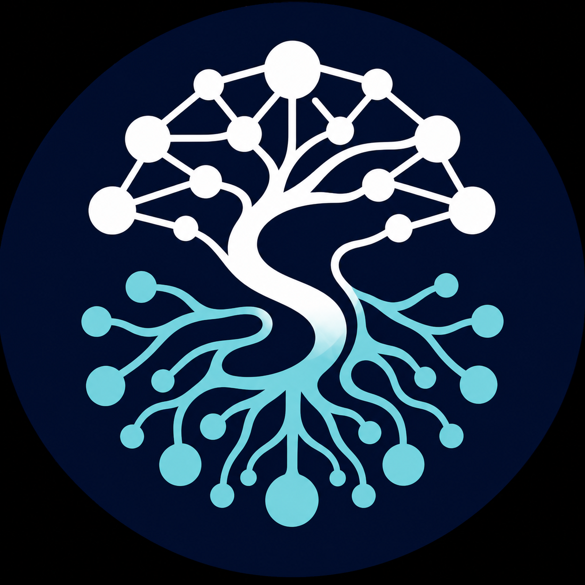
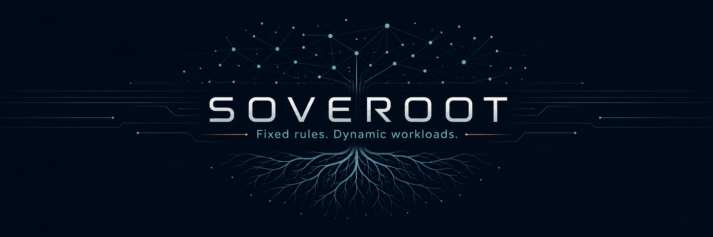
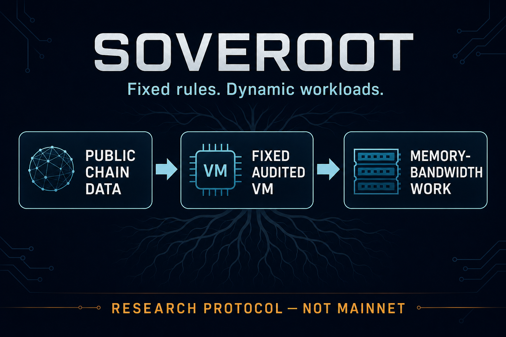

# Soveroot visual theme

Status: selected working brand direction; not final legal trademark clearance

These assets preserve the visual direction created for the earlier BIP110 / BLAKE2d proof-of-work fork project. They are now the source theme for Soveroot: a currency and validation network for people, businesses, devices, and autonomous software, without giving any class of user a privileged identity.

## Primary mark

The circular network tree is the primary Soveroot mark.

The central trunk forms an `S` for Soveroot. The `S` is part of the tree rather than a separate currency glyph:

- the roots represent sovereign individuals and independently operated miners and nodes;
- the canopy represents peers forming a network without a central operator;
- the connected circles represent many independently controlled participants;
- the white-to-cyan transition joins validation above with participation below.

The clearer `S` treatment is the selected working primary mark. The subtler treatment is retained for comparison, and the original unmodified tree remains the canonical source reference.

## Supporting theme

The banner establishes the wide-format treatment, typography, network canopy, root system, and deep-navy technical atmosphere.

The proof-of-work diagram establishes the presentation style for research diagrams: navy panels, cyan network lines, white type, and a limited amber research-status accent.

`Fixed rules. Dynamic workloads.` may be used as a technical research tagline. It must not imply that an experimental workload has passed the project's security, decentralization, or mainnet-readiness gates.

## Color and layout direction

- Deep navy: primary field and background.
- White or cool silver: validation, protocol rules, and primary wordmark.
- Cyan or aqua: roots, peer links, and active network elements.
- Amber: sparingly, for laboratory or research-status notices.
- Preserve generous dark space, crisp node-and-line geometry, and the tree/root motif.

Do not introduce Bitcoin's `B`, a dollar sign, an AI-specific symbol, corporate imagery, or claims such as `quantum proof`, `fully decentralized`, or `mainnet ready` into official brand assets.

## Asset inventory

| Asset | Role | Dimensions |
| --- | --- | --- |
| `assets/branding/soveroot-logo.png` | Stable filename for the selected working primary mark | 1254 x 1254 |
| `assets/branding/soveroot-logo-trunk-s-clear-v2.png` | Versioned source for the selected working primary mark | 1254 x 1254 |
| `assets/branding/soveroot-logo-trunk-s-subtle-v1.png` | Alternate subtler `S` treatment | 1254 x 1254 |
| `assets/branding/soveroot-theme-primary-tree-source.png` | Original primary-tree source | 1254 x 1254 |
| `assets/branding/soveroot-theme-banner-source.png` | Original wide banner source | 2172 x 724 |
| `assets/branding/soveroot-theme-pow-diagram-source.png` | Original research-diagram source | 1536 x 1024 |

The three source files were supplied by the project owner from the earlier BIP110 / BLAKE2d fork work. Preserve them unchanged when producing future variants. Before commercial use, release packaging, or trademark registration, record the applicable ownership and licensing evidence and complete a mark search.
